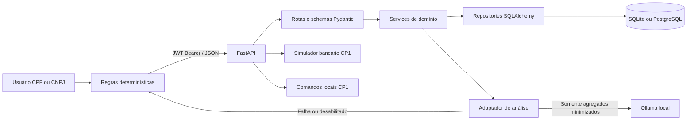
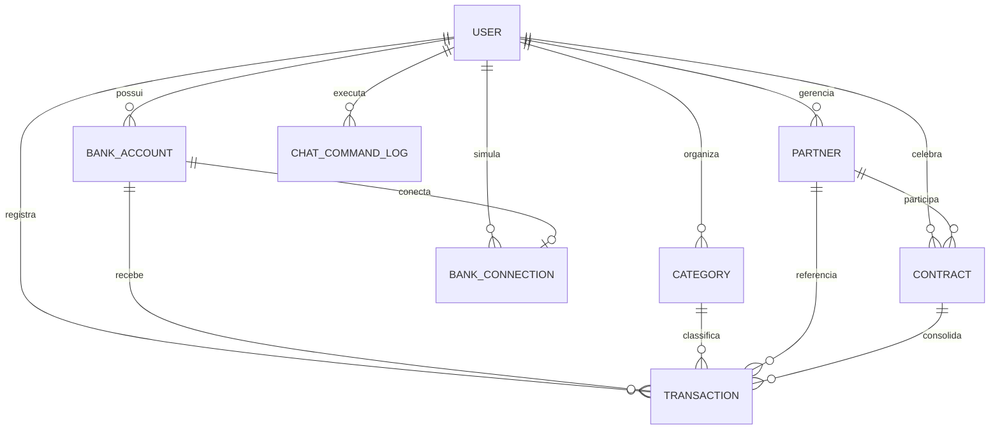

# Arquitetura do FinChat CP2

## Visão geral

O CP2 preserva o núcleo FastAPI do CP1 e adiciona uma aplicação React, um serviço de agregação para dashboard e uma análise híbrida com Ollama local e fallback determinístico. O frontend nunca acessa o banco nem replica cálculos financeiros: toda regra e todo total vêm da API autenticada.

## Responsabilidades

| Camada | Responsabilidade |
| --- | --- |
| `frontend/src/services/api.ts` | URL central, JWT, timeout e tratamento global de 401 |
| `app/api/routes` | Contrato HTTP, autenticação, parâmetros e envelopes |
| `app/schemas` | Validação de entrada e saída; dinheiro permanece `Decimal` |
| `app/services` | Regras, agregações do dashboard e minimização para IA |
| `app/repositories` | Consultas isoladas por `user_id`, paginação e ordenação |
| `app/integrations` | Provedores substituíveis: banco simulado, WhatsApp local, Ollama e fallback determinístico |
| `app/models` | Entidades, FKs, constraints e índices |

## Fluxos críticos

### Dashboard

1. O frontend envia apenas o intervalo de datas.
2. A API obtém a identidade do JWT.
3. `dashboard_overview` agrega receitas, despesas, saldos, categorias, meses e contas no banco do usuário.
4. Para CNPJ, o mesmo serviço adiciona contratos e parceiros.
5. Uma única resposta alimenta cards, gráficos, tabela e alertas.

### Análise inteligente

1. O backend calcula o dashboard; totais enviados pelo navegador são ignorados.
2. `llm_financial_context` cria um payload mínimo, sem nome, documento, e-mail, telefone, token, conta ou identificador bancário.
3. O adaptador usa saída estruturada validada por Pydantic.
4. O resultado é educacional e somente leitura.

## Diagrama ER

## Segurança

- CORS aceita somente as origens explícitas de `CORS_ORIGINS`.
- JWT usa algoritmo fixo `HS256`, emissor, audiência, expiração e claims obrigatórias.
- Todas as consultas de negócio incluem o `user_id` autenticado.
- CPF não acessa parceiros nem contratos, inclusive por URL direta.
- Logs registram somente rota e classe do erro, nunca valores de payload.
- `.env`, banco, logs, cobertura e builds não são versionados.

## Limites preservados para o CP3

Não há Open Finance real, mensageria WhatsApp real, armazenamento de credenciais bancárias, recomendação de investimento nem escrita de dados pela IA.
